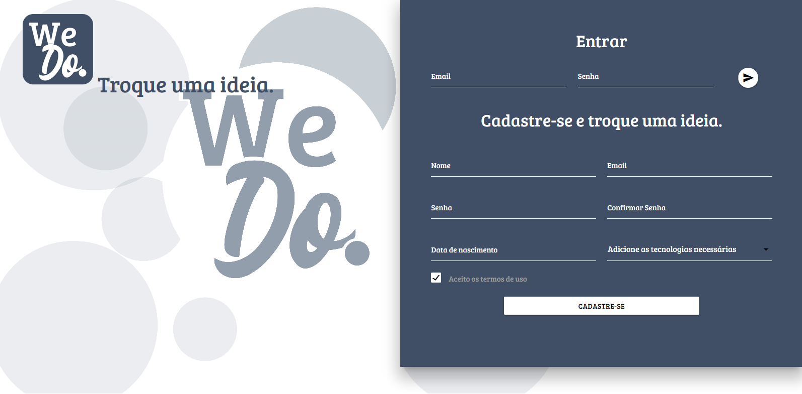

# We Do - Plataforma de ideias  




We Do é uma plataforma gratuita para que pessoas que tem ideias de projetos mas que não tem o conhecimento técnico para desenvolver encontre pessoas com o conhecimento em questão, trazendo uma comunicação efetiva entre os membros da equipe formada pelo We Do.  


We Do também tem sua versão mobile. Confira clicando [aqui](https://github.com/Luuck4s/We-Do-Mobile).  


Para utilizar essa versão pública você deve executar alguns passos: 

1. Preparar o ambiente  


Você deve instalar as seguintes ferramentas:

- Node JS
- NPM
- Mysql
- Algum servidor local (wamp, xampp, live server, usbwebserver, etc)

2. Realizar o download da base de dados do sistema We Do  

Para baixar os scripts de criação do banco, clique [aqui](https://github.com/marcos96x/we-do-database).  

3. Realizar o download da API do sistema  

Para baixar a API, clique [aqui](https://github.com/marcos96x/we-do-api) e siga os passos indicados no repositório da API para o uso correto.  

Por conta da política de privacidade do módulo CORS usado na API, é necessário que o client esteja em um servidor local. O sistema está configurado para ser usado no live server encontrado no Visual studio code. Caso utilize outro tipo de servidor local, insira a url do seu localhost no arquivo js/url_api.js.  

```
const url_api = "http://localhost:3000"
const url_socket = "http://localhost:8080"
const url_web = "http://127.0.0.1:5500" // aqui será o endereço conforme seu localhost
```


