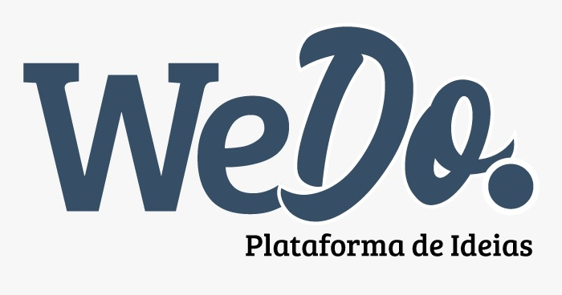
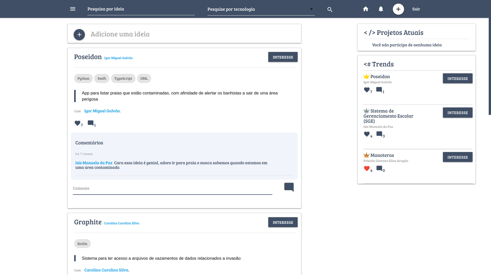
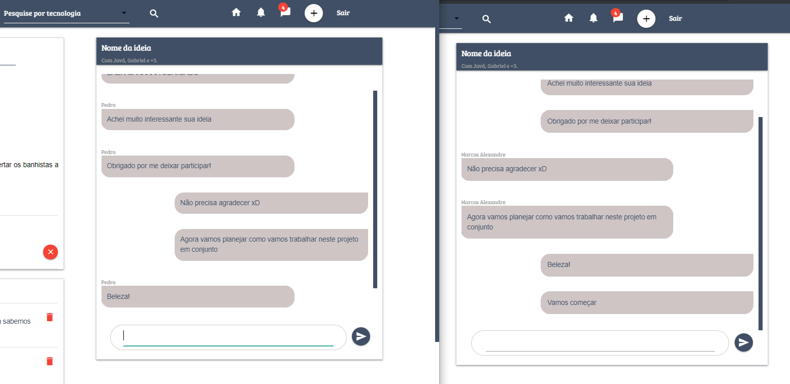

# We Do - Plataforma de ideias  

We Do é uma plataforma gratuita para que pessoas que tem ideias de projetos mas que não tem o conhecimento técnico para desenvolver encontre pessoas com o conhecimento em questão, trazendo uma comunicação efetiva entre os membros da equipe formada pelo We Do.  

#### Tela inicial
  

Ao se cadastrar, você será redirecionado à página do feed, onde será possível você visualizar ideias postadas na plataforma que tem como tecnologias de desenvolvimento alguma na qual o usuário também tenha. É possível interagir com essas ideias, podendo curtir, comentar e/ou solicitar interesse para participar da ideia, de forma que o idealizador da ideia receba em tempo real sua solicitação. Caso o idealizador não esteja online, a solicitação ficará armazenada em suas notificações.  
Além disso, é possível também visualizar os projetos atuais, que são os projetos que você está atualmente; os trends, que são as 3 ideias mais curtidas da plataforma e também é possível realizar buscas de ideias através do titulo da ideia ou de suas tags, pela tecnologia ou por ambos, na barra de pesquisa no canto superior do feed.

#### Feed
  

Para criar uma ideia no We Do basta clicar no icone de adicionar no canto superior direito que estará presente em todas as páginas ou no botão de adicionar ideia, no início do feed.  

#### Adicionar ideia


Ao fazer parte de uma ideia, o usuário terá acesso ao chat em tempo real interno da ideia, onde apenas membros da mesma poderão conversar entre si sobre o projeto.  

#### Chat
  

We Do também tem sua versão mobile. Confira clicando [aqui](https://github.com/Luuck4s/We-Do-Mobile).  

Para utilizar essa versão pública você deve executar alguns passos: 

1. Preparar o ambiente  

Você deve instalar as seguintes ferramentas:

- [Node JS](https://nodejs.org/en/)
- [NPM](https://www.npmjs.com/)
- [Mysql](https://www.mysql.com/)
- Algum servidor local ([WampServer](http://www.wampserver.com/en/), [xampp](https://www.apachefriends.org/pt_br/download.html), [live server(Plugin do vscode)](https://marketplace.visualstudio.com/items?itemName=ritwickdey.LiveServer), [usbwebserver](https://www.usbwebserver.net/webserver/), etc)

2. Realizar o download da base de dados do sistema We Do  

Para baixar os scripts de criação do banco, clique [aqui](https://github.com/marcos96x/we-do-database).  

3. Realizar o download da API do sistema  

Para baixar a API, clique [aqui](https://github.com/marcos96x/we-do-api) e siga os passos indicados no repositório da API para o uso correto.  

Por conta da política de privacidade do módulo CORS usado na API, é necessário que o client esteja em um servidor local. O sistema está configurado para ser usado no live server encontrado no Visual studio code. Caso utilize outro tipo de servidor local, insira a url do seu localhost no arquivo js/url_api.js.  

```
const url_api = "http://localhost:3000"
const url_socket = "http://localhost:8080"
const url_web = "http://127.0.0.1:5500" // aqui será o endereço conforme seu localhost
```

#### Para mais detalhes, consulte nossa [documentação oficial](https://google.com)

